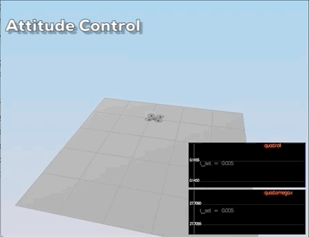
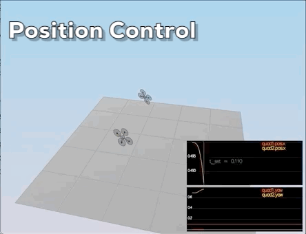
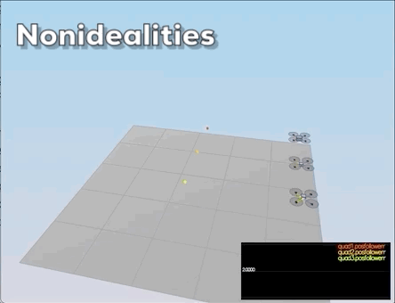

# Quadrotor 3D Cascaded PID Controller

This is the third project of Udacity FCND Nanodegree. In this project, I've implemented the cascaded controller based on PID to guide a quadrotor flying stably in the simulator.

The simulator includes several pre-defined scenarios, which use to test if the controller works properly and the parameters are reasonable for this quadrotor.

The controller follows the architecture as below:

PID parameters locates in the file [config/QuadControlParams.txt](config/QuadControlParams.txt). The controller code is in the [src/QuadControlParams.cpp](src/QuadContrl.cpp), where:

- `GenerateMotorCommands()` - convert quad moment to desired thrust commands for each motor. This part relies on the Vehicle Dynamics。

Test scenarios and passed animations show below:

- Scenario 2 - AttitudeControl
	- `BodyRateControl()`
	- `RollPitchControl()`

- Scenario 3 - PositionControl
	- `LateralPositionControl()`
	- `AltitudeControl()`
	- `YawControl()`

 

- Scenario 4 - Nonidealities

- Scenario 5 - Trajectory Follow

## To-Dos
- [ ] Fine-tune parameters for better performance
- [ ] Add Theories parts for vehicle dynamics and controller
- [ ] Complete Challenge Scenarios

---
> The C++ project coded by taking this [Python controller code](https://github.com/udacity/FCND-Controls/blob/solution/controller.py) as a reference.

> The original project intro could find in [here](./README_Origin.md).
